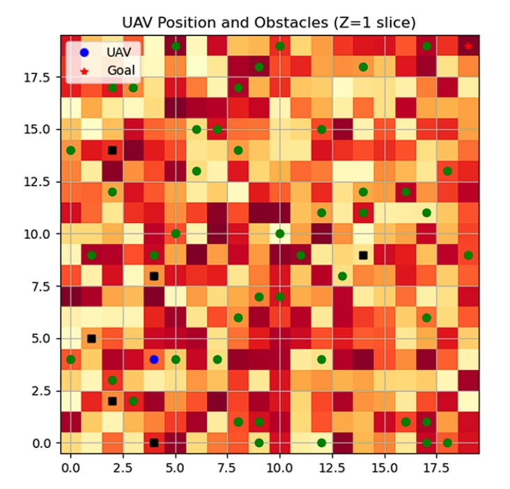
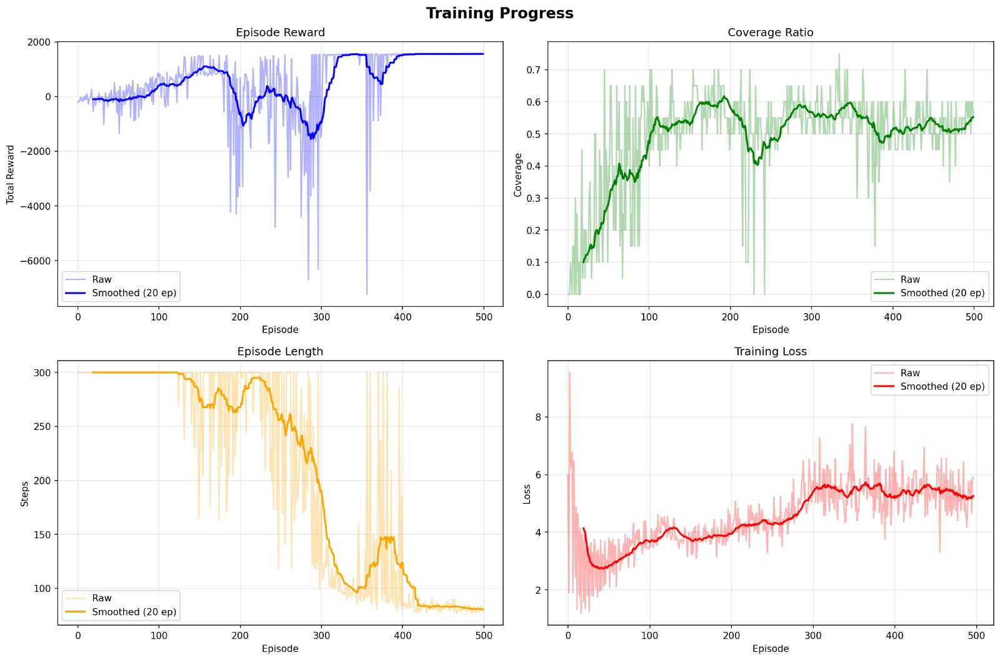
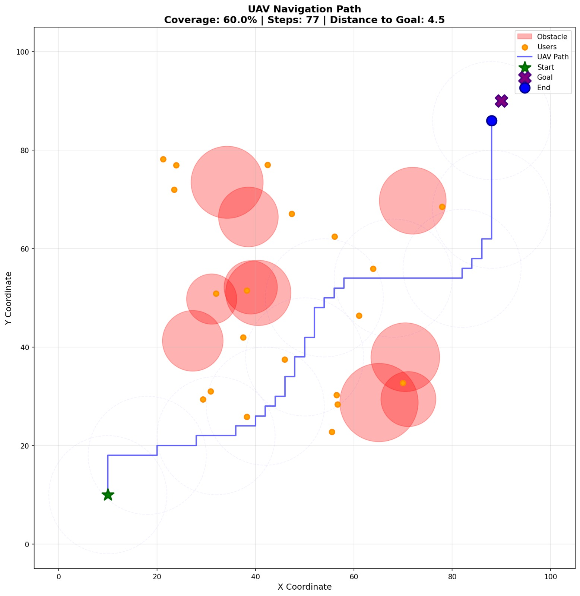

# 🚁 Deep Reinforcement Learning for UAV Path Optimization

<div align="center">

### Autonomous UAV Navigation in Multi-Layer Non-Terrestrial Networks (NTNs) using **Dueling Double Deep Q-Network (D3QN)**

*A Deep Reinforcement Learning framework for autonomous UAV path planning under Integrated Communication and Sensing (ICAS) constraints.*


</div>

---

## 📖 Overview

Natural disasters often damage terrestrial communication infrastructure, making coordination between rescue teams extremely difficult.

This project presents a **Deep Reinforcement Learning (DRL)** framework that enables an autonomous **Unmanned Aerial Vehicle (UAV)** to navigate disaster-affected environments while simultaneously maintaining communication quality, sensing the environment, avoiding obstacles, and minimizing energy consumption.

The solution is built around a **custom OpenAI Gym-compatible UAV environment** and a **Dueling Double Deep Q-Network (D3QN)** agent trained to learn optimal navigation policies through interaction with the environment.

---

## ✨ Key Features

* 🚁 Custom UAV simulation environment
* 🧠 Dueling Double Deep Q-Network (D3QN)
* 🔄 Experience Replay Buffer
* 🎯 Target Network Synchronization
* 📉 ε-Greedy Exploration Strategy
* 📡 Communication-aware path planning
* 🛰️ NTN & ICAS inspired simulation
* ⚡ Energy-efficient navigation
* 🚧 Obstacle avoidance
* 📊 Training & evaluation pipeline
* 💾 Automatic model checkpointing
* 📈 Performance visualization

---

# 📸 Project Demonstration

<p align="center">





</p>

<p align="center">

<b>Simulation Environment</b>       <b>Training Performance</b>       <b>Learned UAV Trajectory</b>

</p>

---

# 📑 Table of Contents

* Overview
* Motivation
* Problem Statement
* System Architecture
* Reinforcement Learning Formulation
* State Space
* Action Space
* Reward Function
* Dueling Double DQN Architecture
* Experience Replay
* Target Network
* Training Pipeline
* Results
* Folder Structure
* Installation
* Usage
* Future Work
* References

---

# 🎯 Motivation

Natural disasters such as earthquakes, floods, cyclones, and wildfires frequently damage terrestrial communication infrastructure, making coordination between emergency responders extremely challenging. In such situations, **Unmanned Aerial Vehicles (UAVs)** can rapidly establish temporary communication links while simultaneously surveying affected regions.

Traditional path planning techniques rely on predefined routes or static optimization algorithms that struggle to adapt to dynamic environments containing changing obstacles, fluctuating communication quality, and limited onboard energy.

This project investigates how **Deep Reinforcement Learning (DRL)** can enable a UAV to learn an optimal navigation policy directly through interaction with the environment. Instead of following handcrafted rules, the UAV continuously improves its decisions by maximizing long-term rewards that jointly consider communication reliability, sensing coverage, obstacle avoidance, and energy efficiency.

The resulting framework demonstrates how reinforcement learning can be applied to autonomous aerial navigation in **Multi-Layer Non-Terrestrial Networks (NTNs)** under **Integrated Communication and Sensing (ICAS)** constraints.

---

# ❓ Problem Statement

Design an intelligent UAV navigation framework capable of autonomously operating in disaster-affected environments where terrestrial communication infrastructure is unavailable.

The autonomous agent should simultaneously:

* Maintain reliable communication links by operating within high-SNR regions.
* Maximize sensing coverage of the disaster area.
* Avoid static obstacles and restricted regions.
* Minimize unnecessary energy consumption.
* Reach mission objectives through efficient path planning.

The optimization objective is formulated as a **multi-objective reinforcement learning problem**, where the UAV learns an optimal policy by interacting with a custom simulation environment rather than following manually designed trajectories.

---

# 🌍 System Scenario

The simulated environment models a post-disaster deployment scenario involving a **multi-layer Non-Terrestrial Network (NTN)** architecture.

The network consists of:

* 🚁 UAV acting as an intelligent aerial relay
* 🛰️ High Altitude Platform (HAP)
* 🌎 Low Earth Orbit (LEO) satellite connectivity
* 👥 Ground users requiring emergency communication support

The UAV continuously observes environmental conditions, selects navigation actions, receives feedback through a reward function, and gradually learns policies that balance communication quality, sensing performance, collision avoidance, and energy consumption.

# 🏗️ System Architecture

The framework consists of four major components that work together to train an autonomous UAV navigation policy.

```text
                 ┌──────────────────────────────┐
                 │      Simulation Environment  │
                 │      (UAVEnv)                │
                 └──────────────┬───────────────┘
                                │
                          Current State
                                │
                                ▼
                  ┌────────────────────────┐
                  │   Dueling Double DQN   │
                  │       Agent            │
                  └──────────┬─────────────┘
                             │
                     Selected Action
                             │
                             ▼
                  ┌────────────────────────┐
                  │      UAV Environment   │
                  │ Position • SNR • Users │
                  │ Obstacles • Battery    │
                  └──────────┬─────────────┘
                             │
                Next State + Reward + Done
                             │
                             ▼
                 Experience Replay Buffer
                             │
                             ▼
                  Network Optimization
```

---

# ⚙️ Reinforcement Learning Pipeline

The learning process follows the standard Deep Reinforcement Learning workflow.

1. Initialize the UAV simulation environment.
2. Observe the current environment state.
3. Select an action using the ε-Greedy policy.
4. Execute the selected action.
5. Receive the next state and reward.
6. Store the transition in the Replay Buffer.
7. Sample a random mini-batch from memory.
8. Update the Dueling Double DQN network.
9. Periodically synchronize the Target Network.
10. Repeat until convergence.

---

# 📊 State Space

At every time step, the UAV observes a compact state vector describing both its current status and the surrounding environment.

| Feature                     | Description                    |
| --------------------------- | ------------------------------ |
| X Position                  | Current X-coordinate           |
| Y Position                  | Current Y-coordinate           |
| Z Position                  | Current altitude               |
| Battery Level               | Remaining battery percentage   |
| Signal-to-Noise Ratio (SNR) | Communication quality          |
| Coverage Ratio              | Percentage of explored region  |
| Distance to Goal            | Euclidean distance from target |
| Obstacle Proximity          | Distance to nearest obstacle   |

The state representation combines communication, navigation, sensing, and energy information into a single observation vector used by the reinforcement learning agent.

---

# 🎮 Action Space

The UAV operates in a discrete action space consisting of seven navigation actions.

| Action ID | Movement               |
| --------- | ---------------------- |
| 0         | Move Up                |
| 1         | Move Down              |
| 2         | Move Left              |
| 3         | Move Right             |
| 4         | Move Forward Diagonal  |
| 5         | Move Backward Diagonal |
| 6         | Hover                  |

Invalid actions that move the UAV outside the environment or into obstacles are rejected by the simulation environment.

---

# 🎁 Reward Function

The agent is trained using a multi-objective reward function designed to balance communication quality, sensing efficiency, navigation safety, and battery consumption.

```text
Reward =
+ α × Communication Quality (SNR)
+ β × New Area Coverage
− γ × Collision Penalty
− δ × Energy Consumption
```

The reward encourages the UAV to:

* Maintain high communication quality.
* Explore previously unseen regions.
* Reach the destination efficiently.
* Avoid collisions with obstacles.
* Minimize unnecessary energy expenditure.

Instead of optimizing a single objective, the agent learns to balance multiple competing objectives simultaneously, resulting in more robust navigation policies suitable for disaster-response scenarios.


